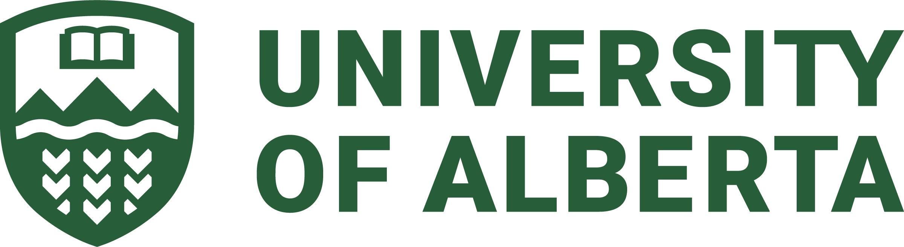

# stable-diffusion-k8s-deploy

---

## 🤝 Support

Many Bothans died to bring us this information. This project is provided as-is, but reasonable questions may be answered based on my coffee intake or mood. ;)

Feel free to open an issue or email **[khoja1@ualberta.ca](mailto:khoja1@ualberta.ca)** or **[kali2@ualberta.ca](mailto:kali2@ualberta.ca)** for U of A related deployments.

## 📜 License

This project is released under the **MIT License** - one of the most permissive open-source licenses available.

**What this means:**
- ✅ Use it for anything (personal, commercial, whatever)
- ✅ Modify it however you want
- ✅ Distribute it freely
- ✅ Include it in proprietary software

**The only requirement:** Keep the copyright notice somewhere in your project.

That's it! No other strings attached. The MIT License is trusted by major projects worldwide and removes virtually all legal barriers to using this code.

**Full license text:** [MIT License](./LICENSE)

## 🧠 About University of Alberta Research Computing

The [Research Computing Group](https://www.ualberta.ca/en/information-services-and-technology/research-computing/index.html) supports high-performance computing, data-intensive research, and advanced infrastructure for researchers at the University of Alberta and across Canada.

We help design and operate compute environments that power innovation — from AI training clusters to national research infrastructure.

